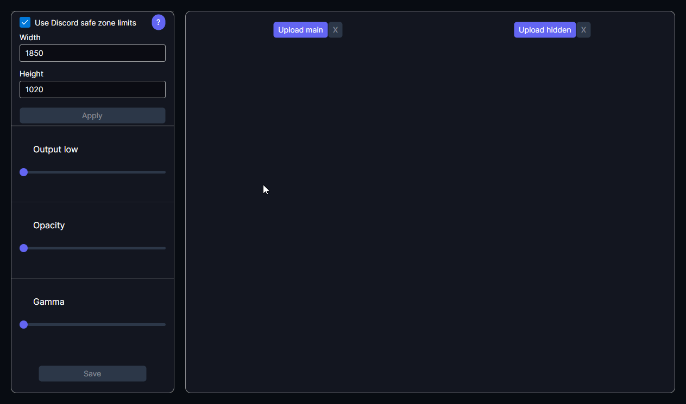
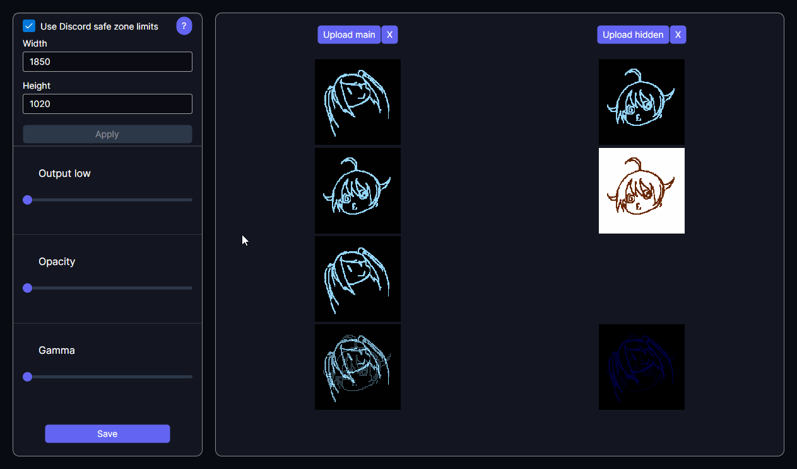
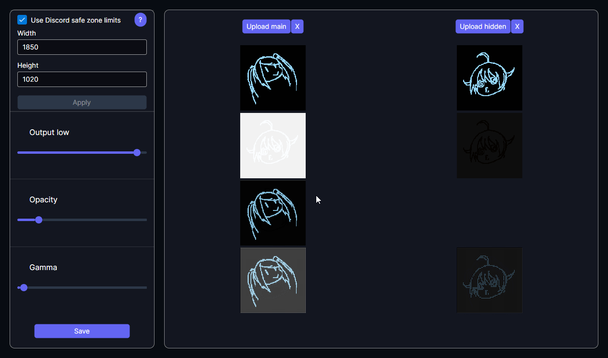
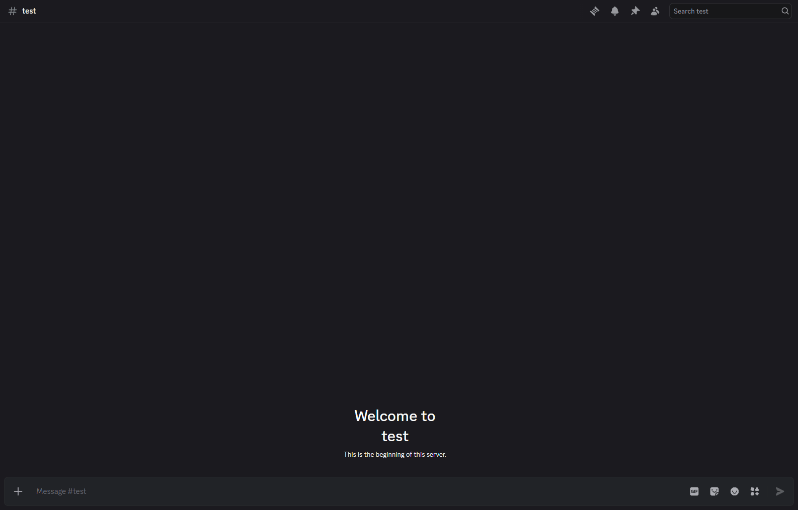

# Hybrid Image Generator 

## 📖 About
Hybrid Image Generator is an application designed to create hybrid images by taking advantage of specific image processing and the PNG format's `gAMA` chunk.

## 🚀 How to use the app
1. **Run the app:** You can download the executable from the [releases](https://github.com/vellxalization/HybridImageGenerator/releases) page, use the [online version](https://vellxalization.github.io/HybridImageGenerator/) hosted on GitHub Pages, or build and run the app yourself (instructions provided below).
2. **Load your images:** Select your "main" image (which will appear as the thumbnail) and your "hidden" image (which will be revealed when viewed in full-screen).
> [!NOTE]
> If you use the Discord Safe Zone tool, the app will warn you if your main image might cause scaling issues.



3. **Adjust parameters:** Tweak the sliders until you are satisfied with the result.
> [!TIP]
> In most cases, you will want to set Output Low to high, Opacity to low, and Gamma to even lower. However, each set of images will require slightly different values to ensure the balance between both images. Use the bottom two previews to adjust the values exactly, as they show the final result.



4. **Export:** Click the "Save" button to export your hybrid image.  
  


## 🔨 Building the app
The only requirement to build the application is the .NET 9.0 SDK (or newer).
1. Clone the repository:
```bash
git clone https://github.com/vellxalization/HybridImageGenerator.git
```

2. Navigate to the desktop project directory:
```bash
cd PATH_TO/HybridImageGenerator/HybridImageGenerator.Desktop
```

3. Publish the app:
* For Windows:
```bash
dotnet publish -r win-x64 -c Release --self-contained
```

* For Linux:
```bash
dotnet publish -r linux-x64 -c Release --self-contained
```

> [!TIP]
> You can use the `--output PATH` flag to publish the app to a specific directory.
4. Run the generated executable.

## ❗ Known issues
* File types don't work properly when uploading images in Firefox browser

## 🎨 How does the effect work?
The following section explains exactly how this effect is achieved from both an image processing standpoint and in terms of how it interacts with Discord's backend.

### What is a hybrid image?
The core idea is simple. You have Picture A, dithered with very bright pixels from Picture B. Under normal conditions, you just see Picture A with a lot of seemingly white pixels. However, when you drastically lower the gamma of the image, those bright pixels restore their original values, becoming much clearer and revealing Picture B.

There are three main aspects to making hybrid images work on Discord:
1. Image processing: Dithering and overlaying the images.
2. File patching: Modifying the file's metadata to tell apps to display the image with the desired gamma.
3. Discord Media Proxy: Using Discord's image compression to our advantage

### ⚙️ Image processing
First, we need to composite the image. We take two different pictures: the "main" image (thumbnail preview) and the "hidden" image (full-screen reveal).
1. **Adjust levels**: We raise the output low of the hidden image, making it very bright and washed out.
2. **Invert**: We create a copy of this output low image with inverted colors.
3. **Overlay**: The inverted copy is overlaid on top of the main image at a low opacity.
4. **Dither**: We dither the overlaid image from the previous step with the original output low image. This app uses a checkered pattern, but hypothetically, any alternating pattern would work.

### 🧵 Patching the file
After processing, we must patch the output file. The PNG format specification allows images to include a gAMA chunk, which instructs decoding applications on how to adjust pixel brightness.  
The chunk stores the gamma value multiplied by 100,000 (e.g., a default value of 0.45455 is stored as 45455). For this effect, you typically want to set this value very low (around a few thousand at most) because higher values won't darken the image enough to reveal the hidden picture.  
If you view the patched file in a standard file explorer, you should see the effect in action: the thumbnail will be the main image. However, opening it in an image viewer will reveal the hidden image.

### 💻 How does this work in Discord?
There are a few caveats to getting the effect to work on Discord.  
When you send an image, users see a thumbnail limited to 550x350 pixels. Larger images are automatically downscaled. When you click the thumbnail, the Discord client requests a larger version from its media proxy service. The exact size requested depends on the user's app window size.  
Crucially, the proxy server handles the resizing, not the client. When a client requests a full-sized, lossless image, the proxy sends the image as is. However, if a client requests a smaller image, the proxy rescales it and _removes the gAMA chunk in the process_.

For the hybrid image to work on Discord, the image must be:
1. **Larger than 550x350 pixels** so the initial thumbnail is downscaled by the proxy, intentionally stripping its gAMA chunk.
2. **Small enough to fit the client's monitor** without triggering another proxy downscale upon expanding, ensuring the gAMA chunk remains intact for the full-screen view.

The latter is pretty tricky as there are no hard limits on image size because it depends on aspect ratios and local window sizes. A hybrid image that works perfectly on a large monitor might break on a laptop screen.  
To solve this, the app includes a **Discord Safe Zone** tool. By inputting the target Discord window size, the tool will warn you if your main image is too big or too small.
